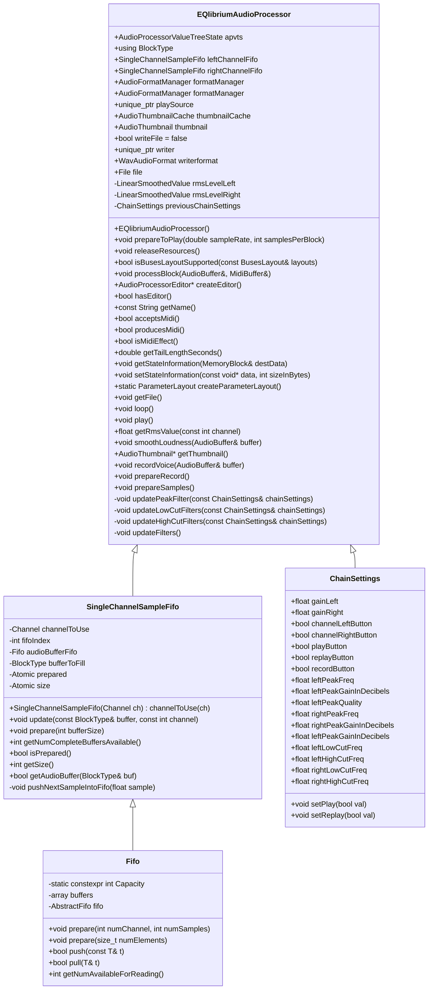

## Documentation

# Architecture overview
---
PluginProcessor

---
PluginEditor

```mermaid
classDiagram
EQlibriumAudioProcessor <|-- EQlibriumAudioProcessorEditor
EQlibriumAudioProcessorEditor <|-- LevelMeterComponent
EQlibriumAudioProcessorEditor <|-- EQImages
EQlibriumAudioProcessorEditor <|-- WaveForm
EQlibriumAudioProcessorEditor <|-- PathProducerComponent
PathProducerComponent <|-- PathProducer
PathProducer <|-- AnalyzerPathGenerator
PathProducer <|-- FFTDataGenerator
EQlibriumAudioProcessorEditor <|-- ResponseCurveComponent
EQlibriumAudioProcessorEditor <|-- ChannelButtons
ChannelButtons <|-- LookAndFeelChannelButtons
EQlibriumAudioProcessorEditor <|-- GlowImageButtons
GlowImageButtons <|-- LookAndFeelGlowButton
EQlibriumAudioProcessorEditor <|-- LinearSliderWithLabels
LinearSliderWithLabels <|-- LookAndFeelLinearSlider
LinearSliderWithLabels <|-- LabelPos
EQlibriumAudioProcessorEditor <|-- NormalImageButtons
NormalImageButtons <|-- LookAndFeelNormalImageButtons
EQlibriumAudioProcessorEditor <|-- PlayButton
PlayButton <|-- LookAndFeelPlayButton
EQlibriumAudioProcessorEditor <|-- RotarySliderWithLabels
RotarySliderWithLabels <|-- LookAndFeelRotarySlider
RotarySliderWithLabels <|-- LabelPos
EQlibriumAudioProcessorEditor : -EQlibriumAudioProcessor& audioProcessor
EQlibriumAudioProcessorEditor : -Rectangle<int> window_full_rect
EQlibriumAudioProcessorEditor : -Rectangle<int> window_micro_rect
EQlibriumAudioProcessorEditor : -Rectangle<int> window_settings_rect
EQlibriumAudioProcessorEditor : -Rectangle<int> window_graph_rect
EQlibriumAudioProcessorEditor : -Rectangle<int> window_channel_label_left
EQlibriumAudioProcessorEditor : -Rectangle<int> window_channel_label_right
EQlibriumAudioProcessorEditor : -Rectangle<int> window_inner_grap_rect
EQlibriumAudioProcessorEditor : -Rectangle<int> window_filter_rect
EQlibriumAudioProcessorEditor : -Rectangle<int> window_filter_left_rect
EQlibriumAudioProcessorEditor : -Rectangle<int> window_filter_right_rect
EQlibriumAudioProcessorEditor : -Rectangle<int> window_analyser_rect
EQlibriumAudioProcessorEditor : -Rectangle<int> window_analyser_left_rect
EQlibriumAudioProcessorEditor : -Rectangle<int> window_analyser_left_filter_rect
EQlibriumAudioProcessorEditor : -Rectangle<int> window_analyser_left_freq_rect
EQlibriumAudioProcessorEditor : -Rectangle<int> window_analyser_right_rect
EQlibriumAudioProcessorEditor : -Rectangle<int> window_analyser_right_filter_rect
EQlibriumAudioProcessorEditor : -Rectangle<int> window_analyser_right_freq_rect
EQlibriumAudioProcessorEditor : -Rectangle<int> window_vumeter_rect
EQlibriumAudioProcessorEditor : -Rectangle<int> window_vumeter_left_rect
EQlibriumAudioProcessorEditor : -Rectangle<int> window_vumeter_right_rect
EQlibriumAudioProcessorEditor : -Rectangle<int> peakLeftLabel
EQlibriumAudioProcessorEditor : -Rectangle<int> peakL
EQlibriumAudioProcessorEditor : -Rectangle<int> peakRightLabel
EQlibriumAudioProcessorEditor : -Rectangle<int> peakR
EQlibriumAudioProcessorEditor : -Rectangle<int> highCutLeftLabel
EQlibriumAudioProcessorEditor : -Rectangle<int> highCutL
EQlibriumAudioProcessorEditor : -Rectangle<int> highCutRightLabel
EQlibriumAudioProcessorEditor : -Rectangle<int> highCutR
EQlibriumAudioProcessorEditor : -Rectangle<int> lowCutLeftLabel
EQlibriumAudioProcessorEditor : -Rectangle<int> lowCutL
EQlibriumAudioProcessorEditor : -Rectangle<int> lowCutRightLabel
EQlibriumAudioProcessorEditor : -Rectangle<int> lowCutR
EQlibriumAudioProcessorEditor : -RotarySliderWithLabels peakFreqSliderLeft
EQlibriumAudioProcessorEditor : -RotarySliderWithLabels peakGainSliderLeft
EQlibriumAudioProcessorEditor : -RotarySliderWithLabels peakQualitySliderLeft
EQlibriumAudioProcessorEditor : -RotarySliderWithLabels lowCutFreqSliderLeft
EQlibriumAudioProcessorEditor : -RotarySliderWithLabels highCutFreqSliderLeft
EQlibriumAudioProcessorEditor : -RotarySliderWithLabels lowCutSlopeSliderLeft
EQlibriumAudioProcessorEditor : -RotarySliderWithLabels highCutSlopeSliderLeft
EQlibriumAudioProcessorEditor : -RotarySliderWithLabels peakFreqSliderRight
EQlibriumAudioProcessorEditor : -RotarySliderWithLabels peakGainSliderRight
EQlibriumAudioProcessorEditor : -RotarySliderWithLabels peakQualitySliderRight
EQlibriumAudioProcessorEditor : -RotarySliderWithLabels lowCutFreqSliderRight
EQlibriumAudioProcessorEditor : -RotarySliderWithLabels highCutFreqSliderRight
EQlibriumAudioProcessorEditor : -RotarySliderWithLabels lowCutSlopeSliderRight
EQlibriumAudioProcessorEditor : -RotarySliderWithLabels highCutSlopeSliderRight
EQlibriumAudioProcessorEditor : -LinearSliderWithLabels gainSliderLeft
EQlibriumAudioProcessorEditor : -LinearSliderWithLabels gainSliderRight
EQlibriumAudioProcessorEditor : -ResponseCurveComponent filterLeft
EQlibriumAudioProcessorEditor : -ResponseCurveComponent filterRight
EQlibriumAudioProcessorEditor : -PathProducerComponent freqLeft
EQlibriumAudioProcessorEditor : -PathProducerComponent freqRight
EQlibriumAudioProcessorEditor : -ChannelButtons channelButtonLeft
EQlibriumAudioProcessorEditor : -ChannelButtons channelButtonRight
EQlibriumAudioProcessorEditor : -NormalImageButtons fileChooserButton
EQlibriumAudioProcessorEditor : -NormalImageButtons saveButton
EQlibriumAudioProcessorEditor : -WaveForm waveGraph
EQlibriumAudioProcessorEditor : -PlayButton playButton
EQlibriumAudioProcessorEditor : -GlowImageButtons replayButton
EQlibriumAudioProcessorEditor : -GlowImageButtons microphoneButton
EQlibriumAudioProcessorEditor : -using APVTS
EQlibriumAudioProcessorEditor : -using SliderAttachment
EQlibriumAudioProcessorEditor : -SliderAttachment leftPeakFreqSliderAttachment
EQlibriumAudioProcessorEditor : -SliderAttachment leftPeakGainSliderAttachment
EQlibriumAudioProcessorEditor : -SliderAttachment leftPeakQualitySliderAttachment
EQlibriumAudioProcessorEditor : -SliderAttachment leftLowCutFreqSliderAttachment
EQlibriumAudioProcessorEditor : -SliderAttachment leftHighCutFreqSliderAttachment
EQlibriumAudioProcessorEditor : -SliderAttachment leftLowCutSlopeSliderAttachment
EQlibriumAudioProcessorEditor : -SliderAttachment leftHighCutSlopeSliderAttachment
EQlibriumAudioProcessorEditor : -SliderAttachment rightPeakFreqSliderAttachment
EQlibriumAudioProcessorEditor : -SliderAttachment rightPeakGainSliderAttachment
EQlibriumAudioProcessorEditor : -SliderAttachment rightPeakQualitySliderAttachment
EQlibriumAudioProcessorEditor : -SliderAttachment rightLowCutFreqSliderAttachment
EQlibriumAudioProcessorEditor : -SliderAttachment rightHighCutFreqSliderAttachment
EQlibriumAudioProcessorEditor : -SliderAttachment rightLowCutSlopeSliderAttachment
EQlibriumAudioProcessorEditor : -SliderAttachment rightHighCutSlopeSliderAttachment
EQlibriumAudioProcessorEditor : -SliderAttachment leftGainAttachment
EQlibriumAudioProcessorEditor : -SliderAttachment rightGainAttachment
EQlibriumAudioProcessorEditor : -using ButtonAttachment
EQlibriumAudioProcessorEditor : -ButtonAttachment leftChannelButtonAttachment
EQlibriumAudioProcessorEditor : -ButtonAttachment rightChannelButtonAttachment
EQlibriumAudioProcessorEditor : -ButtonAttachment fileChooserAttachment
EQlibriumAudioProcessorEditor : -ButtonAttachment microphoneAttachment
EQlibriumAudioProcessorEditor : -ButtonAttachment saveAttachment
EQlibriumAudioProcessorEditor : -ButtonAttachment playAttachment
EQlibriumAudioProcessorEditor : -ButtonAttachment replayAttachment
EQlibriumAudioProcessorEditor : -LevelMeterComponent levelMeterLeft
EQlibriumAudioProcessorEditor : -LevelMeterComponent levelMeterRight
EQlibriumAudioProcessorEditor : -LookAndFeelChannelButtons lnfCh
EQlibriumAudioProcessorEditor : -LookAndFeelNormalImageButtons lnfImgBtn
EQlibriumAudioProcessorEditor : -LookAndFeelPlayButton lnfPlay
EQlibriumAudioProcessorEditor : -LookAndFeelPlayButton lnfGlow
EQlibriumAudioProcessorEditor : +EQlibriumAudioProcessorEditor (EQlibriumAudioProcessor&)
EQlibriumAudioProcessorEditor : +paint(Graphics&)
EQlibriumAudioProcessorEditor : +void resized()
EQlibriumAudioProcessorEditor : -vector<Component*> getComps()

class LevelMeterComponent{
    -EQlibriumAudioProcessor& audioProcessor
    -int channel
    -MonoChain monoChain
    -float level
    -Rectangle<float> levelRect
    +LevelMeterComponent(EQlibriumAudioProcessor&, int)
    +void parameterValueChanged(int parameterIndex, float newValue)
    +void parameterGestureChanged(int parameterIndex, bool gestureIsStarting)
    +void timerCallback()
    +void paint(Graphics& g)
    +void resized()
    +void setLevel(const float value)
}

class EQImages{
    +int width
    +int height
    -int image
    -String imagePath
    +EQImages(imageNames val)
    +Image getImage()
}

class WaveForm{
    -EQlibriumAudioProcessor& audioProcessor
    -Atomic<bool> parametersChanged
    -MonoChain monoChain
    -AudioThumbnail* thumbnail
    +WaveForm(EQlibriumAudioProcessor&)
    +void parameterValueChanged(int parameterIndex, float newValue)
    +void parameterGestureChanged(int parameterIndex, bool gestureIsStarting)
    +void timerCallback()
    +void paint(Graphics& g)
    +void resized()
}

class PathProducerComponent{
    -EQlibriumAudioProcessor& audioProcessor
    -int channel
    -Atomic<bool> parametersChanged
    -MonoChain monoChain
    -Image background
    -PathProducer pathProducer
    +PathProducerComponent(EQlibriumAudioProcessor&, int)
    +void parameterValueChanged(int parameterIndex, float newValue)
    +void parameterGestureChanged(int parameterIndex, bool gestureIsStarting)
    +void timerCallback()
    +void paint(Graphics& g)
    +void resized()
    -void updateChain()
    -Rectangle<int> getRenderArea()
    -Rectangle<int> getAnalysisArea()
}

class PathProducer{
    -SingleChannelSampleFifo<EQlibriumAudioProcessor::BlockType>* ChannelFifo
    -AudioBuffer<float> monoBuffer
    -FFTDataGenerator<vector<float>> ChannelFFTDataGenerator
    -AnalyzerPathGenerator<Path> pathProducer
    -Path ChannelFFTPath
    PathProducer(SingleChannelSampleFifo<BlockType>& scsf) : ChannelFifo(&scsf)
    +void process(Rectangle<float> fftBounds, double sampleRate)
    +Path getPath()
}

class AnalyzerPathGenerator{
    -Fifo<PathType> pathFifo
    +void generatePath(const vector<float>& renderData, Rectangle<float> fftBounds, int fftSize, float binWidth, float negativeInfinity)
    +int getNumPathsAvailable()
    +bool getPath(PathType& path)
}

class FFTDataGenerator{
    -FFTOrder order
    -BlockType fftData
    -unique_ptr<FFT> forwardFFT
    -unique_ptr<WindowingFunction<float>> window
    -Fifo<BlockType> fftDataFifo
    +void produceFFTDataForRendering(const AudioBuffer<float>& audioData, const float negativeInfinity)
    +void changeOrder(FFTOrder newOrder)
    +int getFFTSize()
    +int getNumAvailableFFTDataBlocks()
    +bool getFFTData(BlockType& fftData)
}

class ResponseCurveComponent{
    -EQlibriumAudioProcessor& audioProcessor
    -Atomic<bool> parametersChanged
    -int channel
    -MonoChain monoChain
    -Image background
    +ResponseCurveComponent(EQlibriumAudioProcessor&, int)
    +void parameterValueChanged(int parameterIndex, float newValue)
    +void parameterGestureChanged(int parameterIndex, bool gestureIsStarting)
    +void timerCallback()
    +void paint(Graphics& g)
    +void resized()
    -void updateChain()
    -Rectangle<int> getRenderArea()
    -Rectangle<int> getAnalysisArea()
}

class ChannelButtons{
    +String label
    +void paint(Graphics& g)
}

class LookAndFeelChannelButtons{
    +void drawToggleButton(Graphics &g, ToggleButton & toggleButton, bool shouldDrawButtonAsHighlighted, bool shouldDrawButtonAsDown)
}

class GlowImageButtons{
    +imageNames image
    +GlowImageButtons(imageNames img)
    +void paint(Graphics& g)
}

class LookAndFeelGlowButton{
    void drawToggleButton(Graphics &g, ToggleButton & toggleButton, bool shouldDrawButtonAsHighlighted, bool shouldDrawButtonAsDown)
}

class LinearSliderWithLabels{
    +Array<LabelPos> labels
    -LookAndFeelLinearSlider lnf
    -RangedAudioParameter* param
    -String suffix
    LinearSliderWithLabels(RangedAudioParameter& rap, const String& unitSuffix) : Slider(RotaryHorizontalVerticalDrag, NoTextBox), param(&rap),suffix(unitSuffix)
    +void paint(Graphics& g)
    +Rectangle<int> getSliderBounds()
    +String getDisplayString()
}

class LookAndFeelLinearSlider{
    void drawLinearSlider(Graphics&, int x, int y, int width, int height, float sliderPos, float minSliderPos, float maxSliderPos, Slider::SliderStyle, Slider&)
}

class NormalImageButtons{
    +imageNames imageSet
    +NormalImageButtons(imageNames val)
    +void paint(Graphics& g)
}

class LookAndFeelNormalImageButtons{
    void drawToggleButton(Graphics &g, ToggleButton & toggleButton, bool shouldDrawButtonAsHighlighted, bool shouldDrawButtonAsDown)
}

class PlayButton{
    +imageNames imagePlay
    +imageNames imagePause
    +PlayButton(imageNames play, imageNames pause)
    +void paint(Graphics& g)
}

class LookAndFeelPlayButton{
    +void drawToggleButton(Graphics &g, ToggleButton & toggleButton, bool shouldDrawButtonAsHighlighted, bool shouldDrawButtonAsDown)
}

class RotarySliderWithLabels{
    +Array<LabelPos> labels
    -LookAndFeelRotarySlider lnf
    -RangedAudioParameter* param
    -String suffix
    +RotarySliderWithLabels(RangedAudioParameter& rap, const String& unitSuffix) : Slider(RotaryHorizontalVerticalDrag, NoTextBox), param(&rap),suffix(unitSuffix)
    +void paint(Graphics& g)
    +Rectangle<int> getSliderBounds()
    +int getTextHeight()
    +String getDisplayString()
}

class LookAndFeelRotarySlider{
    void drawRotarySlider(Graphics&, int x, int y, int width, int height, float sliderPosProportional, float rotaryStartAngle, float rotaryEndAngle,Slider&)
}

class LabelPos{
    +float pos
    +String label
}
```

# Signal processing

# GUI

# Signal flow

# Special features
- Custom VU-Meter with delay (high to low dB)
- Custom filter graph
- Custom frequency graph
- All buttons with own LookAndFeel
- No images from external resources