# Dokumentation

## Architekturübersicht

### PluginProcessor

```mermaid
classDiagram
EQlibriumAudioProcessor <|-- SingleChannelSampleFifo
EQlibriumAudioProcessor <|-- ChainSettings
SingleChannelSampleFifo <|-- Fifo
EQlibriumAudioProcessor : +AudioProcessorValueTreeState apvts
EQlibriumAudioProcessor : +using BlockType
EQlibriumAudioProcessor : +SingleChannelSampleFifo<BlockType> leftChannelFifo
EQlibriumAudioProcessor : +SingleChannelSampleFifo<BlockType> rightChannelFifo
EQlibriumAudioProcessor : +AudioFormatManager formatManager
EQlibriumAudioProcessor : +AudioFormatManager formatManager
EQlibriumAudioProcessor : +unique_ptr<AudioFormatReaderSource> playSource
EQlibriumAudioProcessor : +AudioThumbnailCache thumbnailCache
EQlibriumAudioProcessor : +AudioThumbnail thumbnail
EQlibriumAudioProcessor : +bool writeFile = false
EQlibriumAudioProcessor : +unique_ptr<AudioFormatWriter> writer
EQlibriumAudioProcessor : +WavAudioFormat writerformat
EQlibriumAudioProcessor : +File file
EQlibriumAudioProcessor : -LinearSmoothedValue<float> rmsLevelLeft
EQlibriumAudioProcessor : -LinearSmoothedValue<float> rmsLevelRight
EQlibriumAudioProcessor : -ChainSettings previousChainSettings
EQlibriumAudioProcessor : +EQlibriumAudioProcessor()
EQlibriumAudioProcessor : +void prepareToPlay(double sampleRate, int samplesPerBlock)
EQlibriumAudioProcessor : +void releaseResources()
EQlibriumAudioProcessor : +bool isBusesLayoutSupported(const BusesLayout& layouts)
EQlibriumAudioProcessor : +void processBlock(AudioBuffer<float>&, MidiBuffer&)
EQlibriumAudioProcessor : +AudioProcessorEditor* createEditor()
EQlibriumAudioProcessor : +bool hasEditor()
EQlibriumAudioProcessor : +const String getName()
EQlibriumAudioProcessor : +bool acceptsMidi()
EQlibriumAudioProcessor : +bool producesMidi()
EQlibriumAudioProcessor : +bool isMidiEffect()
EQlibriumAudioProcessor : +double getTailLengthSeconds()
EQlibriumAudioProcessor : +void getStateInformation (MemoryBlock& destData)
EQlibriumAudioProcessor : +void setStateInformation (const void* data, int sizeInBytes)
EQlibriumAudioProcessor : +static ParameterLayout createParameterLayout()
EQlibriumAudioProcessor : +void getFile()
EQlibriumAudioProcessor : +void loop()
EQlibriumAudioProcessor : +void play()
EQlibriumAudioProcessor : +float getRmsValue(const int channel)
EQlibriumAudioProcessor : +void smoothLoudness(AudioBuffer<float>& buffer)
EQlibriumAudioProcessor : +AudioThumbnail* getThumbnail()
EQlibriumAudioProcessor : +void recordVoice(AudioBuffer<float>& buffer)
EQlibriumAudioProcessor : +void prepareRecord()
EQlibriumAudioProcessor : +void prepareSamples()
EQlibriumAudioProcessor : -void updatePeakFilter(const ChainSettings& chainSettings)
EQlibriumAudioProcessor : -void updateLowCutFilters(const ChainSettings& chainSettings)
EQlibriumAudioProcessor : -void updateHighCutFilters(const ChainSettings& chainSettings)
EQlibriumAudioProcessor : -void updateFilters()

class SingleChannelSampleFifo{
    -Channel channelToUse
    -int fifoIndex
    -Fifo<BlockType> audioBufferFifo
    -BlockType bufferToFill
    -Atomic<bool> prepared
    -Atomic<int> size
    +SingleChannelSampleFifo(Channel ch) : channelToUse(ch)
    +void update(const BlockType& buffer, const int channel)
    +void prepare(int bufferSize)
    +int getNumCompleteBuffersAvailable()
    +bool isPrepared()
    +int getSize()
    +bool getAudioBuffer(BlockType& buf)
    -void pushNextSampleIntoFifo(float sample)
}

class ChainSettings{
    +float gainLeft
    +float gainRight
    +bool channelLeftButton
    +bool channelRightButton
    +bool playButton
    +bool replayButton
    +bool recordButton
    +Mixer mixer
    +float leftPeakFreq
    +float leftPeakGainInDecibels
    +float leftPeakQuality
    +float rightPeakFreq
    +float rightPeakGainInDecibels
    +float leftPeakGainInDecibels
    +float leftLowCutFreq
    +float leftHighCutFreq
    +float rightLowCutFreq
    +float rightHighCutFreq
    +Slope leftLowCutSlope
    +Slope leftHighCutSlope
    +Slope rightLowCutSlope
    +Slope rightHighCutSlope
    +void setPlay(bool val)
    +void setReplay(bool val)
}

class Fifo{
    -static constexpr int Capacity
    -array<T, Capacity> buffers
    -AbstractFifo fifo
    +void prepare(int numChannel, int numSamples)
    +void prepare(size_t numElements)
    +bool push(const T& t)
    +bool pull(T& t)
    +int getNumAvailableForReading()
}
```

### PluginEditor

```mermaid
classDiagram
EQlibriumAudioProcessor <|-- EQlibriumAudioProcessorEditor
EQlibriumAudioProcessorEditor <|-- LevelMeterComponent
EQlibriumAudioProcessorEditor <|-- EQImages
EQlibriumAudioProcessorEditor <|-- WaveForm
EQlibriumAudioProcessorEditor <|-- PathProducerComponent
PathProducerComponent <|-- PathProducer
PathProducer <|-- AnalyzerPathGenerator
PathProducer <|-- FFTDataGenerator
EQlibriumAudioProcessorEditor <|-- ResponseCurveComponent
EQlibriumAudioProcessorEditor <|-- ChannelButtons
ChannelButtons <|-- LookAndFeelChannelButtons
EQlibriumAudioProcessorEditor <|-- GlowImageButtons
GlowImageButtons <|-- LookAndFeelGlowButton
EQlibriumAudioProcessorEditor <|-- LinearSliderWithLabels
LinearSliderWithLabels <|-- LookAndFeelLinearSlider
LinearSliderWithLabels <|-- LabelPos
EQlibriumAudioProcessorEditor <|-- NormalImageButtons
NormalImageButtons <|-- LookAndFeelNormalImageButtons
EQlibriumAudioProcessorEditor <|-- PlayButton
PlayButton <|-- LookAndFeelPlayButton
EQlibriumAudioProcessorEditor <|-- RotarySliderWithLabels
RotarySliderWithLabels <|-- LookAndFeelRotarySlider
RotarySliderWithLabels <|-- LabelPos
EQlibriumAudioProcessorEditor <|-- LookAndFeelComboBox
EQlibriumAudioProcessorEditor <|-- LookAndFeelToolTip
EQlibriumAudioProcessorEditor : -EQlibriumAudioProcessor& audioProcessor
EQlibriumAudioProcessorEditor : -Rectangle<int> window_full_rect
EQlibriumAudioProcessorEditor : -Rectangle<int> window_micro_rect
EQlibriumAudioProcessorEditor : -Rectangle<int> window_settings_rect
EQlibriumAudioProcessorEditor : -Rectangle<int> window_graph_rect
EQlibriumAudioProcessorEditor : -Rectangle<int> window_channel_label_left
EQlibriumAudioProcessorEditor : -Rectangle<int> window_channel_label_right
EQlibriumAudioProcessorEditor : -Rectangle<int> window_inner_grap_rect
EQlibriumAudioProcessorEditor : -Rectangle<int> window_filter_rect
EQlibriumAudioProcessorEditor : -Rectangle<int> window_filter_left_rect
EQlibriumAudioProcessorEditor : -Rectangle<int> window_filter_right_rect
EQlibriumAudioProcessorEditor : -Rectangle<int> window_analyser_rect
EQlibriumAudioProcessorEditor : -Rectangle<int> window_analyser_left_rect
EQlibriumAudioProcessorEditor : -Rectangle<int> window_analyser_left_filter_rect
EQlibriumAudioProcessorEditor : -Rectangle<int> window_analyser_left_freq_rect
EQlibriumAudioProcessorEditor : -Rectangle<int> window_analyser_right_rect
EQlibriumAudioProcessorEditor : -Rectangle<int> window_analyser_right_filter_rect
EQlibriumAudioProcessorEditor : -Rectangle<int> window_analyser_right_freq_rect
EQlibriumAudioProcessorEditor : -Rectangle<int> window_vumeter_rect
EQlibriumAudioProcessorEditor : -Rectangle<int> window_vumeter_left_rect
EQlibriumAudioProcessorEditor : -Rectangle<int> window_vumeter_right_rect
EQlibriumAudioProcessorEditor : -Rectangle<int> peakLeftLabel
EQlibriumAudioProcessorEditor : -Rectangle<int> peakL
EQlibriumAudioProcessorEditor : -Rectangle<int> peakRightLabel
EQlibriumAudioProcessorEditor : -Rectangle<int> peakR
EQlibriumAudioProcessorEditor : -Rectangle<int> highCutLeftLabel
EQlibriumAudioProcessorEditor : -Rectangle<int> highCutL
EQlibriumAudioProcessorEditor : -Rectangle<int> highCutRightLabel
EQlibriumAudioProcessorEditor : -Rectangle<int> highCutR
EQlibriumAudioProcessorEditor : -Rectangle<int> lowCutLeftLabel
EQlibriumAudioProcessorEditor : -Rectangle<int> lowCutL
EQlibriumAudioProcessorEditor : -Rectangle<int> lowCutRightLabel
EQlibriumAudioProcessorEditor : -Rectangle<int> lowCutR
EQlibriumAudioProcessorEditor : -RotarySliderWithLabels peakFreqSliderLeft
EQlibriumAudioProcessorEditor : -RotarySliderWithLabels peakGainSliderLeft
EQlibriumAudioProcessorEditor : -RotarySliderWithLabels peakQualitySliderLeft
EQlibriumAudioProcessorEditor : -RotarySliderWithLabels lowCutFreqSliderLeft
EQlibriumAudioProcessorEditor : -RotarySliderWithLabels highCutFreqSliderLeft
EQlibriumAudioProcessorEditor : -RotarySliderWithLabels lowCutSlopeSliderLeft
EQlibriumAudioProcessorEditor : -RotarySliderWithLabels highCutSlopeSliderLeft
EQlibriumAudioProcessorEditor : -RotarySliderWithLabels peakFreqSliderRight
EQlibriumAudioProcessorEditor : -RotarySliderWithLabels peakGainSliderRight
EQlibriumAudioProcessorEditor : -RotarySliderWithLabels peakQualitySliderRight
EQlibriumAudioProcessorEditor : -RotarySliderWithLabels lowCutFreqSliderRight
EQlibriumAudioProcessorEditor : -RotarySliderWithLabels highCutFreqSliderRight
EQlibriumAudioProcessorEditor : -RotarySliderWithLabels lowCutSlopeSliderRight
EQlibriumAudioProcessorEditor : -RotarySliderWithLabels highCutSlopeSliderRight
EQlibriumAudioProcessorEditor : -LinearSliderWithLabels gainSliderLeft
EQlibriumAudioProcessorEditor : -LinearSliderWithLabels gainSliderRight
EQlibriumAudioProcessorEditor : -ResponseCurveComponent filterLeft
EQlibriumAudioProcessorEditor : -ResponseCurveComponent filterRight
EQlibriumAudioProcessorEditor : -PathProducerComponent freqLeft
EQlibriumAudioProcessorEditor : -PathProducerComponent freqRight
EQlibriumAudioProcessorEditor : -ChannelButtons channelButtonLeft
EQlibriumAudioProcessorEditor : -ChannelButtons channelButtonRight
EQlibriumAudioProcessorEditor : -NormalImageButtons fileChooserButton
EQlibriumAudioProcessorEditor : -NormalImageButtons saveButton
EQlibriumAudioProcessorEditor : -WaveForm waveGraph
EQlibriumAudioProcessorEditor : -PlayButton playButton
EQlibriumAudioProcessorEditor : -GlowImageButtons replayButton
EQlibriumAudioProcessorEditor : -GlowImageButtons microphoneButton
EQlibriumAudioProcessorEditor : -ComboBox equalizerInputButton
EQlibriumAudioProcessorEditor : -using APVTS
EQlibriumAudioProcessorEditor : -using SliderAttachment
EQlibriumAudioProcessorEditor : -SliderAttachment leftPeakFreqSliderAttachment
EQlibriumAudioProcessorEditor : -SliderAttachment leftPeakGainSliderAttachment
EQlibriumAudioProcessorEditor : -SliderAttachment leftPeakQualitySliderAttachment
EQlibriumAudioProcessorEditor : -SliderAttachment leftLowCutFreqSliderAttachment
EQlibriumAudioProcessorEditor : -SliderAttachment leftHighCutFreqSliderAttachment
EQlibriumAudioProcessorEditor : -SliderAttachment leftLowCutSlopeSliderAttachment
EQlibriumAudioProcessorEditor : -SliderAttachment leftHighCutSlopeSliderAttachment
EQlibriumAudioProcessorEditor : -SliderAttachment rightPeakFreqSliderAttachment
EQlibriumAudioProcessorEditor : -SliderAttachment rightPeakGainSliderAttachment
EQlibriumAudioProcessorEditor : -SliderAttachment rightPeakQualitySliderAttachment
EQlibriumAudioProcessorEditor : -SliderAttachment rightLowCutFreqSliderAttachment
EQlibriumAudioProcessorEditor : -SliderAttachment rightHighCutFreqSliderAttachment
EQlibriumAudioProcessorEditor : -SliderAttachment rightLowCutSlopeSliderAttachment
EQlibriumAudioProcessorEditor : -SliderAttachment rightHighCutSlopeSliderAttachment
EQlibriumAudioProcessorEditor : -SliderAttachment leftGainAttachment
EQlibriumAudioProcessorEditor : -SliderAttachment rightGainAttachment
EQlibriumAudioProcessorEditor : -using ButtonAttachment
EQlibriumAudioProcessorEditor : -ButtonAttachment leftChannelButtonAttachment
EQlibriumAudioProcessorEditor : -ButtonAttachment rightChannelButtonAttachment
EQlibriumAudioProcessorEditor : -ButtonAttachment fileChooserAttachment
EQlibriumAudioProcessorEditor : -ButtonAttachment microphoneAttachment
EQlibriumAudioProcessorEditor : -ButtonAttachment saveAttachment
EQlibriumAudioProcessorEditor : -ButtonAttachment playAttachment
EQlibriumAudioProcessorEditor : -ButtonAttachment replayAttachment
EQlibriumAudioProcessorEditor : -using ComboBoxAttachment
EQlibriumAudioProcessorEditor : -ComboBoxAttachment equalizerInputAttachment
EQlibriumAudioProcessorEditor : -LevelMeterComponent levelMeterLeft
EQlibriumAudioProcessorEditor : -LevelMeterComponent levelMeterRight
EQlibriumAudioProcessorEditor : -LookAndFeelChannelButtons lnfCh
EQlibriumAudioProcessorEditor : -LookAndFeelNormalImageButtons lnfImgBtn
EQlibriumAudioProcessorEditor : -LookAndFeelPlayButton lnfPlay
EQlibriumAudioProcessorEditor : -LookAndFeelPlayButton lnfGlow
EQlibriumAudioProcessorEditor : -LookAndFeelComboBox lnfCombo
EQlibriumAudioProcessorEditor : -LookAndFeelToolTip lnfTool
EQlibriumAudioProcessorEditor : -TooltipWindow tooltip
EQlibriumAudioProcessorEditor : +EQlibriumAudioProcessorEditor (EQlibriumAudioProcessor&)
EQlibriumAudioProcessorEditor : +paint(Graphics&)
EQlibriumAudioProcessorEditor : +void resized()
EQlibriumAudioProcessorEditor : -vector<Component*> getComps()
EQlibriumAudioProcessorEditor : -void initParams()
EQlibriumAudioProcessorEditor : -void setlnf()
EQlibriumAudioProcessorEditor : -void clickAction()
EQlibriumAudioProcessorEditor : -void toolTips()

class LevelMeterComponent{
    -EQlibriumAudioProcessor& audioProcessor
    -int channel
    -MonoChain monoChain
    -float level
    -Rectangle<float> levelRect
    +LevelMeterComponent(EQlibriumAudioProcessor&, int)
    +void parameterValueChanged(int parameterIndex, float newValue)
    +void parameterGestureChanged(int parameterIndex, bool gestureIsStarting)
    +void timerCallback()
    +void paint(Graphics& g)
    +void resized()
    +void setLevel(const float value)
}

class EQImages{
    +int width
    +int height
    -int image
    -String imagePath
    +EQImages(imageNames val)
    +Image getImage()
}

class WaveForm{
    -EQlibriumAudioProcessor& audioProcessor
    -Atomic<bool> parametersChanged
    -MonoChain monoChain
    -AudioThumbnail* thumbnail
    +WaveForm(EQlibriumAudioProcessor&)
    +void parameterValueChanged(int parameterIndex, float newValue)
    +void parameterGestureChanged(int parameterIndex, bool gestureIsStarting)
    +void timerCallback()
    +void paint(Graphics& g)
    +void resized()
}

class PathProducerComponent{
    -EQlibriumAudioProcessor& audioProcessor
    -int channel
    -Atomic<bool> parametersChanged
    -MonoChain monoChain
    -Image background
    -PathProducer pathProducer
    +PathProducerComponent(EQlibriumAudioProcessor&, int)
    +void parameterValueChanged(int parameterIndex, float newValue)
    +void parameterGestureChanged(int parameterIndex, bool gestureIsStarting)
    +void timerCallback()
    +void paint(Graphics& g)
    +void resized()
    -void updateChain()
    -Rectangle<int> getRenderArea()
    -Rectangle<int> getAnalysisArea()
}

class PathProducer{
    -SingleChannelSampleFifo<EQlibriumAudioProcessor::BlockType>* ChannelFifo
    -AudioBuffer<float> monoBuffer
    -FFTDataGenerator<vector<float>> ChannelFFTDataGenerator
    -AnalyzerPathGenerator<Path> pathProducer
    -Path ChannelFFTPath
    PathProducer(SingleChannelSampleFifo<BlockType>& scsf) : ChannelFifo(&scsf)
    +void process(Rectangle<float> fftBounds, double sampleRate)
    +Path getPath()
}

class AnalyzerPathGenerator{
    -Fifo<PathType> pathFifo
    +void generatePath(const vector<float>& renderData, Rectangle<float> fftBounds, int fftSize, float binWidth, float negativeInfinity)
    +int getNumPathsAvailable()
    +bool getPath(PathType& path)
}

class FFTDataGenerator{
    -FFTOrder order
    -BlockType fftData
    -unique_ptr<FFT> forwardFFT
    -unique_ptr<WindowingFunction<float>> window
    -Fifo<BlockType> fftDataFifo
    +void produceFFTDataForRendering(const AudioBuffer<float>& audioData, const float negativeInfinity)
    +void changeOrder(FFTOrder newOrder)
    +int getFFTSize()
    +int getNumAvailableFFTDataBlocks()
    +bool getFFTData(BlockType& fftData)
}

class ResponseCurveComponent{
    -EQlibriumAudioProcessor& audioProcessor
    -Atomic<bool> parametersChanged
    -int channel
    -MonoChain monoChain
    -Image background
    +ResponseCurveComponent(EQlibriumAudioProcessor&, int)
    +void parameterValueChanged(int parameterIndex, float newValue)
    +void parameterGestureChanged(int parameterIndex, bool gestureIsStarting)
    +void timerCallback()
    +void paint(Graphics& g)
    +void resized()
    -void updateChain()
    -Rectangle<int> getRenderArea()
    -Rectangle<int> getAnalysisArea()
}

class ChannelButtons{
    +String label
    +void paint(Graphics& g)
}

class LookAndFeelChannelButtons{
    +void drawToggleButton(Graphics &g, ToggleButton & toggleButton, bool shouldDrawButtonAsHighlighted, bool shouldDrawButtonAsDown)
}

class GlowImageButtons{
    +imageNames image
    +GlowImageButtons(imageNames img)
    +void paint(Graphics& g)
}

class LookAndFeelGlowButton{
    void drawToggleButton(Graphics &g, ToggleButton & toggleButton, bool shouldDrawButtonAsHighlighted, bool shouldDrawButtonAsDown)
}

class LinearSliderWithLabels{
    +Array<LabelPos> labels
    -LookAndFeelLinearSlider lnf
    -RangedAudioParameter* param
    -String suffix
    LinearSliderWithLabels(RangedAudioParameter& rap, const String& unitSuffix) : Slider(RotaryHorizontalVerticalDrag, NoTextBox), param(&rap),suffix(unitSuffix)
    +void paint(Graphics& g)
    +Rectangle<int> getSliderBounds()
    +String getDisplayString()
}

class LookAndFeelLinearSlider{
    void drawLinearSlider(Graphics&, int x, int y, int width, int height, float sliderPos, float minSliderPos, float maxSliderPos, Slider::SliderStyle, Slider&)
}

class NormalImageButtons{
    +imageNames imageSet
    +NormalImageButtons(imageNames val)
    +void paint(Graphics& g)
}

class LookAndFeelNormalImageButtons{
    void drawToggleButton(Graphics &g, ToggleButton & toggleButton, bool shouldDrawButtonAsHighlighted, bool shouldDrawButtonAsDown)
}

class PlayButton{
    +imageNames imagePlay
    +imageNames imagePause
    +PlayButton(imageNames play, imageNames pause)
    +void paint(Graphics& g)
}

class LookAndFeelPlayButton{
    +void drawToggleButton(Graphics &g, ToggleButton & toggleButton, bool shouldDrawButtonAsHighlighted, bool shouldDrawButtonAsDown)
}

class RotarySliderWithLabels{
    +Array<LabelPos> labels
    -LookAndFeelRotarySlider lnf
    -RangedAudioParameter* param
    -String suffix
    +RotarySliderWithLabels(RangedAudioParameter& rap, const String& unitSuffix) : Slider(RotaryHorizontalVerticalDrag, NoTextBox), param(&rap),suffix(unitSuffix)
    +void paint(Graphics& g)
    +Rectangle<int> getSliderBounds()
    +int getTextHeight()
    +String getDisplayString()
}

class LookAndFeelRotarySlider{
    void drawRotarySlider(Graphics&, int x, int y, int width, int height, float sliderPosProportional, float rotaryStartAngle, float rotaryEndAngle,Slider&)
}

class LabelPos{
    +float pos
    +String label
}

class LookAndFeelComboBox{
    +LookAndFeelComboBox()
    +void drawComboBox(Graphics& g, int width, int height, bool isButtonDown, int buttonX, int buttonY, int buttonW, int buttonH, juce::ComboBox &)
}

class LookAndFeelToolTip{
    +void drawTooltip(Graphics& g, const juce::String& text, int width, int height)
}
```

## Signalverarbeitung
Das Audiosignal aus unterschiedlichen Quellen (Mikrofon + Audiodatei) wird zusammen gemixt und als gemeinsamer Buffer ausgegeben.

### Hoch-/Tiefpass
Für den Hoch- und Tiefpass wird die Butterworth-Methode eingesetzt, um die Frequenz an den angegebenen Stellen von der Lautstärke zu senken. Je höher der Filter (12, 24, 36, 48), desto steiler der Abfall an der eingestellten Frequenz. (IIR-Filter)

### Kerbfilter
Der Kerbfilter wird im Grunde gänzlich von Juce erzeugt, einzig die gewünschten Änderungen müssen der Funktion makePeakFilter() übergeben werden (Anzahl der Samples, Frequenz, Qualität, Anstieg/Absenkung in dB). Um den Parameter „Qualität“ aufzuschlüsseln: Damit ist gemeint, inwieweit sich der Filter auf benachbarte Frequenzen auswirkt. Je höher der Wert in „Qualität“, desto geringfügiger werden umliegende Frequenzen mit beeinflusst. (IIR-Filter)

## GUI

### Aufnahme und abspielen
Die GUI besteht aus drei Teilen. Im ersten Teil (obere Box) kann durch Klick auf das Ordnersymbol eine .wav- oder .mp3-Datei ausgewählt werden. Mit Klick auf das Mikrofonsymbol kann Audio aufgenommen werden. Wenn die Aufnahme aktiv ist, ist das Mikrofonsymbol grün hinterlegt. Ein erneuter Klick stoppt die Aufnahme. Bei der Aufnahme wird nicht nur Audio vom Mikrofon aufgenommen, sondern auch die Veränderungen durch den Equalizer sowie, falls ausgewählt, auch Hintergrundmusik. Auf der rechten Seite kann eine ausgewählte Audiodatei wiederholt abgespielt werden (Kreis mit zwei Pfeilen). Wenn das Symbol grün hinterlegt ist, ist die Wiederholung der Audiodatei aktiv. Die letzte „aktive“ Funktion ist das Abspielen und Pausieren der Audiodatei. Rechts daneben wird die Waveform der Audiodatei angezeigt, je ein Graph für den linken und den rechten Audiokanal.

### Lautstärke und Kanäle abschalten
Im zweiten Bereich können die Lautstärken für den linken und den rechten Kanal individuell angepasst werden. Die Schaltflächen L und R schalten die jeweiligen Kanäle komplett ab, auch für die Aufnahme. Die grüne Umrandung der Schaltfläche gibt an, dass der Kanal aktiv Audio erhält/erhalten kann. Im ausgeschalteten Zustand ist die Umrandung grau. Zudem gibt es die Möglichkeit, umzustellen, für welches Eingangssignal der Equalizer wirkt:

- „Both“: Der Equalizer verändert das gesamte Audiosignal (Mikrofon, abgespielte Audiodatei, externes Audio)
- „Extern“: Der Equalizer verändert nur Audiosignale von externen Ressourcen (Mikrofon, externes Audio)
- „Intern“: Der Equalizer verändert nur Audiosignale von der abgespielten Audiodatei (Mikrofon und externe Ressourcen bleiben unverändert)

### Equalizer
Im dritten und größten Bereich befindet sich der Equalizer. Der Equalizer kann für jeden Kanal (Stereo) einzeln eingestellt werden. Auf der linken Seite befindet sich der Equalizer für den linken Kanal und auf der rechten Seite der Equalizer für den rechten Kanal. Mit dem Kerbfilter können gezielt Frequenzen angehoben oder verringert werden. Mit dem ersten Drehregler wird die Frequenz eingestellt, mit dem zweiten die „Breite“: Je höher der Wert, desto geringer werden nahe liegende Frequenzen mit angehoben oder gesenkt. Mit dem dritten Drehregler wird die Verstärkung oder Verringerung der Frequenz geregelt, von –24 dB bis +24 dB. Die Einstellung wird im ersten Graph unterhalb der Equalizer-Drehregler graphisch dargestellt.

Unter der Kerbfilter-Einstellung befinden sich die Einstellungen für den Tief- und Hochpass. Beide zusammen können auch als „Bandpass“ genutzt werden. Der jeweils erste Drehregler gibt die Frequenz an, ab der gefiltert werden soll. Bei dem Hochpass werden tiefe Frequenzen entfernt, dementsprechend wird das Signal, das sich unterhalb der angegebenen Frequenz befindet, von der Lautstärke reduziert. Das gleiche gilt für den Tiefpass, nur umgekehrt. Der jeweils zweite Drehregler gibt an, wie stark die Absenkung pro Oktave ist. „Filtersteilheit“ einstellbar sind 12, 24, 36 und 48 dB. Je höher der Wert eingestellt ist, desto schneller sinkt die Lautstärke ab der eingestellten Frequenz ab. Beide Einstellungen werden im gleichen Graphen wie der Kerbfilter angezeigt.

Unterhalb des Filtergraphen wird der Frequenzgraph angezeigt. Wird gerade Audio abgespielt oder in das Mikrofon gesprochen, werden entsprechend die Frequenzen angezeigt. Die Einstellung des Equalizers wirkt sich auch direkt auf den Frequenzgraphen aus. Zuletzt ist unter dem Frequenzgraphen ein VU-Meter, das den Pegel anzeigt. Auch das VU-Meter reagiert auf Pegeländerungen durch die Equalizer-Einstellungen.

## Signalfluss
Die Audioquellen Mikrofon und Audiodatei werden in einem Buffer vereint (sofern eine Audiodatei eingebunden ist und abgespielt wird). Danach wird der Kerbfilter pro Kanal angewandt. Das gleiche Verfahren wie bei dem Kerbfilter wird auch für den Hoch- und Tiefpass angewandt. Die Reihenfolge ist:

- Kerbfilter
- Tiefpass
- Hochpass

Anschließend, sofern die Aufnahmefunktion aktiviert ist, wird der Buffer in eine .wav-Datei geschrieben.

Das Ein- und Ausschalten der Kanäle leert den Buffer für den ausgewählten Kanal. Diese Funktion befindet sich zwischen dem Mischen der Audiobuffer und der Anwendung der Filter.

Wenn der Equalizer-Eingang auf „Both“ gestellt ist, werden die Buffer von Mikrofon/externer Ressource und der Audiodatei am Anfang zusammen gemixt und durch die Filter verändert. Bei der Einstellung „Extern“ wird nur das Mikrofon/externe Ressource durch die Filter verändert und anschließend die Audiodatei in den Buffer gemixt. In der letzten Einstellung „Intern“ wird nur die Audiodatei durch die Filter verändert und das Mikrofon/externe Ressource anschließend in den Buffer gemixt.

## Besonderheiten
- Eigener VU-Meter mit Verzögerung (von hoher zu niedriger Lautstärke) L/R
- Filtergraph L/R
- Frequenzgraph L/R
- Alle Buttons mit eigenem LookAndFeel
- Kombobox mit eigenem LookAndFeel
- Tooltip mit eigenem LookAndFeel
- Keine Bilder von externen Ressourcen